# Bogenampel-Steuerung für ESP32

Dies ist ein Projekt für eine fortschrittliche Ampelsteuerung für den Bogensport, basierend auf dem ESP32-Mikrocontroller. Die Ampel kann als eigenständiger "Master" oder als per Funk gekoppelter "Slave" betrieben werden und bietet eine Steuerung sowohl über eine Weboberfläche als auch über physische Taster und einen Drehgeber.

## ✨ Features

* **Master/Slave-Betrieb**: Ein Master-Gerät steuert die Ampelphasen und synchronisiert einen oder mehrere Slave-Geräte in Echtzeit über **ESP-NOW**.
* **Web-Interface**: Jede Ampel startet einen eigenen Webserver zur Konfiguration und Steuerung.
    * Start / Stop / Not-Stopp der Ampel.
    * Konfiguration der Rolle (Master/Slave).
    * Einstellen des Schießmodus (Standard, AB/CD).
    * Einstellen der Schießzeit (3 Pfeile / 6 Pfeile).
    * Live-Log-Ansicht im Browser.
    * Verwaltung der gekoppelten Slave-MAC-Adressen.
* **Physische Bedienelemente**:
    * **KY-040 Drehgeber** mit Taster zur Menünavigation auf dem OLED-Display.
    * Dedizierte **Start/Stop- und Not-Halt-Taster**.
* **OLED-Display**: Zeigt den aktuellen Status, die verbleibende Zeit, den Modus und ein Konfigurationsmenü an.
* **Akustische Signale**: Ein Piezo-Summer gibt die offiziellen Signaltöne gemäß Sportordnung (z.B. für Start, Stopp, Gruppenwechsel, Gefahr) aus.
* **OTA-Updates**: Over-the-Air-Firmware-Updates können bequem über die Weboberfläche oder die Arduino IDE hochgeladen werden.
* **Persistente Speicherung**: Die Konfiguration (Rolle, Slave-MACs) wird im EEPROM gespeichert und überlebt einen Neustart.

---

## 🛠️ Hardware

Folgende Komponenten werden für einen vollständigen Aufbau benötigt:

| Komponente              | Anzahl | Beschreibung                                        |
| ----------------------- | :----: | --------------------------------------------------- |
| ESP32 Dev Kit C         |   1    | Das Herzstück der Steuerung.                        |
| LED 5mm (Rot)           |   1    | Stopp-Signal.                                       |
| LED 5mm (Gelb)          |   1    | Vorbereitungs-/Restzeit-Signal.                     |
| LED 5mm (Grün)          |   1    | Schießzeit-Signal.                                  |
| LED 5mm (z.B. Weiß)     |   1    | Anzeige für Gruppe AB.                              |
| LED 5mm (z.B. Blau)     |   1    | Anzeige für Gruppe CD.                              |
| Widerstand (220Ω - 330Ω) |   5    | Vorwiderstände für die LEDs.                        |
| Piezo-Summer (aktiv)    |   1    | Für akustische Signale.                             |
| OLED Display 0.96"      |   1    | I2C, 128x64 Pixel, SSD1306 Controller.              |
| KY-040 Drehgeber        |   1    | Inkrementaler Drehgeber mit Taster für die Menüsteuerung. |
| Taster (Push Button)    |   2    | Für Start/Stop und Not-Halt.                        |
| Breadboard & Kabel      |  -     | Für den Prototypenaufbau.                           |
| 5V Stromversorgung      |   1    | z.B. über USB.                                      |

---

## 🔌 Kabelplan & Schematics

Der folgende Schaltplan zeigt die Verkabelung der Komponenten mit dem ESP32. Die Widerstände für die LEDs sollten in Reihe zwischen den GPIO-Pin und die Anode (+) der LED geschaltet werden.

```mermaid
graph TD
    subgraph ESP32 Dev Kit
        D2[GPIO 2]
        D4[GPIO 4]
        D16[GPIO 16]
        D17[GPIO 17]
        D5[GPIO 5]
        D18[GPIO 18]
        D19[GPIO 19]
        D27[GPIO 27]
        D32[GPIO 32]
        D25[GPIO 25]
        D26[GPIO 26]
        D21[SDA]
        D22[SCL]
        GND_ESP[GND]
        V3[3.3V]
    end

    subgraph LEDs
        R_Red[R_220Ω] --> LED_Red(🔴 Rote LED)
        R_Yellow[R_220Ω] --> LED_Yellow(🟡 Gelbe LED)
        R_Green[R_220Ω] --> LED_Green(🟢 Grüne LED)
        R_AB[R_220Ω] --> LED_AB(⚪ AB LED)
        R_CD[R_220Ω] --> LED_CD(🔵 CD LED)
    end

    subgraph Bedienelemente
        Encoder(KY-040 Drehgeber)
        Button_Start(Start/Stop Taster)
        Button_Emergency(Not-Halt Taster)
    end

    subgraph Anzeigen & Ton
        OLED(OLED Display)
        Piezo(Piezo Summer)
    end

    %% Verbindungen
    D2 -- "Anode (+)" --> R_Red
    D4 -- "Anode (+)" --> R_Yellow
    D16 -- "Anode (+)" --> R_Green
    D17 -- "Anode (+)" --> R_AB
    D5 -- "Anode (+)" --> R_CD

    D18 -- "Signal" --> Piezo

    D19 -- "CLK" --> Encoder
    D27 -- "DT" --> Encoder
    D32 -- "SW" --> Encoder

    D25 -- "Signal" --> Button_Start
    D26 -- "Signal" --> Button_Emergency

    D21 -- "SDA" --> OLED
    D22 -- "SCL" --> OLED

    V3 -- "+ / VCC" --> OLED
    V3 -- "+ / VCC" --> Encoder
    V3 -- "Pull-Up Seite" --> Button_Start
    V3 -- "Pull-Up Seite" --> Button_Emergency

    GND_ESP -- "GND" --> OLED
    GND_ESP -- "GND" --> Encoder
    GND_ESP -- "GND" --> Piezo
    GND_ESP -- "GND-Seite" --> Button_Start
    GND_ESP -- "GND-Seite" --> Button_Emergency
    GND_ESP -- "Kathode (-)" --> LED_Red & LED_Yellow & LED_Green & LED_AB & LED_CD

```


*Hinweis: Die Taster (`Start/Stop`, `Not-Halt`) und der Taster des Drehgebers (`SW`) sollten intern per Pull-up-Widerstand des ESP32 konfiguriert oder extern mit einem 10kΩ Widerstand gegen 3.3V geschaltet werden, um schwebende Zustände zu vermeiden. Der Code nutzt die internen Pull-ups.*

---

## ⚙️ Installation

1.  **Arduino IDE einrichten**:
    * Stelle sicher, dass du das ESP32 Board-Paket in deiner Arduino IDE installiert hast.
    * Wähle als Board "ESP32 Dev Module" (oder dein spezifisches Modell).

2.  **Bibliotheken installieren**:
    Installiere die folgenden Bibliotheken über den Arduino Bibliotheksverwalter:
    * `U8g2` by oliver
    * `ArduinoJson` by Benoit Blanchon
    * `Button2` by Lennart Hennigs
    * `ESP32Encoder` by madhephaestus

3.  **WLAN-Daten konfigurieren**:
    Öffne die `.ino`-Datei und passe die WLAN-Zugangsdaten an:
    ```cpp
    const char* ssid = "DEIN_WLAN_NAME";
    const char* password = "DEIN_WLAN_PASSWORT";
    ```

4.  **Code hochladen**:
    * Verbinde deinen ESP32 per USB mit dem Computer.
    * Wähle den richtigen COM-Port in der Arduino IDE aus.
    * Klicke auf "Hochladen".

---

## 🚀 Benutzung

### Erster Start
Beim ersten Start verbindet sich das Gerät mit dem WLAN. Die IP-Adresse wird auf dem OLED-Display und der seriellen Konsole ausgegeben. Öffne diese IP-Adresse in einem Webbrowser, um auf das Web-Interface zuzugreifen.

Standardmäßig startet das Gerät in der **Master-Rolle**.

### Web-Interface
Über die Weboberfläche können alle wichtigen Funktionen gesteuert und konfiguriert werden:
* **Hauptseite**: Zeigt den aktuellen Status an und bietet Buttons zum Starten und Stoppen der Ampel.
* **Einstellungen**:
    * **Rolle**: Wechsle zwischen "Master" und "Slave". Nach dem Wechsel startet das Gerät neu.
    * **Schießzeit**: Wähle zwischen "3 Pfeile" (2 Minuten) und "6 Pfeile" (4 Minuten).
    * **Zielmodus**: Wähle "Standard" (eine Gruppe) oder "AB/CD" (zwei alternierende Gruppen).
    * **Peer-MAC-Adresse**: Hier können die MAC-Adressen von bis zu 5 Slave-Geräten eingetragen werden. Die MAC-Adresse eines jeden Geräts wird beim Start auf dem seriellen Monitor ausgegeben.

### Physische Bedienung (am Gerät)
* **Drehgeber drücken**: Drücke den Taster des Drehgebers, um das Menü auf dem OLED-Display zu öffnen oder zu schließen.
* **Drehgeber drehen**: Navigiere durch das Menü.
* **Drehgeber erneut drücken**: Wähle einen Menüpunkt aus oder bestätige eine Einstellung.
* **Start/Stop-Taster**: Startet die Sequenz (von Rot) oder stoppt sie (und löst den entsprechenden Signalton aus).
* **Not-Halt-Taster**: Stoppt die Ampel sofort, versetzt sie in den Rot-Zustand und spielt ein Gefahrensignal ab.

### Master-Slave-Kopplung
1.  Konfiguriere ein Gerät als **Master**.
2.  Konfiguriere ein oder mehrere Geräte als **Slave**.
3.  Finde die MAC-Adresse jedes Slave-Geräts heraus (wird auf dem seriellen Monitor beim Start angezeigt).
4.  Greife auf das Web-Interface des **Master-Geräts** zu.
5.  Trage die MAC-Adressen der Slaves in die Felder "Peer MAC" ein und speichere sie.
6.  Der Master wird nun bei jeder Zustandsänderung die Informationen an die registrierten Slaves senden, welche diese synchron anzeigen.

---

## 🏗️ Code-Struktur

Der Code ist in logische Blöcke unterteilt:

* **Definitionen & Globale Variablen**: Hier werden Pins, Zustände (`enum State`), Zeitdauern und globale Objekte (Server, Display, Encoder) definiert.
* **`setup()`**: Initialisiert die Hardware (LEDs, Display, Serial), verbindet sich mit dem WLAN, startet ESP-NOW, den Webserver und OTA und lädt gespeicherte Einstellungen aus dem EEPROM.
* **`loop()`**: Die Hauptschleife. Sie ist nicht-blockierend und kümmert sich um:
    * `ArduinoOTA.handle()` und `server.handleClient()` für Netzwerkkommunikation.
    * Auswertung des Drehgebers und der Taster (`Button2.loop()`).
    * Aufruf der Zustandslogik (`processTrafficLightState()`), nur auf dem Master.
    * Aktualisierung von Display (`updateDisplay()`) und LEDs (`updateLEDs()`).
    * Keep-Alive-Logik für die ESP-NOW-Verbindung.
* **`processTrafficLightState()`**: Der Kern des Zustandsautomaten. Läuft nur auf dem Master und schaltet die Ampelphasen basierend auf Zeit und manuellen Triggern.
* **`setState()`**: Zentrale Funktion zum Ändern des Ampelzustands. Spielt die zugehörigen Töne ab und sendet den neuen Zustand an die Slaves (wenn Master).
* **ESP-NOW Callbacks (`OnDataSent`, `OnDataRecv`)**: Behandeln das Senden und Empfangen von Daten über ESP-NOW.
* **Webserver Handler (`handle...`)**: Funktionen, die aufgerufen werden, wenn eine bestimmte URL am Webserver aufgerufen wird (z.B. `handleRoot`, `handleWebStart`).
* **Display & LED Funktionen (`updateDisplay`, `drawMenu`, `updateLEDs`)**: Zuständig für die visuelle Ausgabe.
* **EEPROM Funktionen**: Laden und Speichern der Konfiguration.
